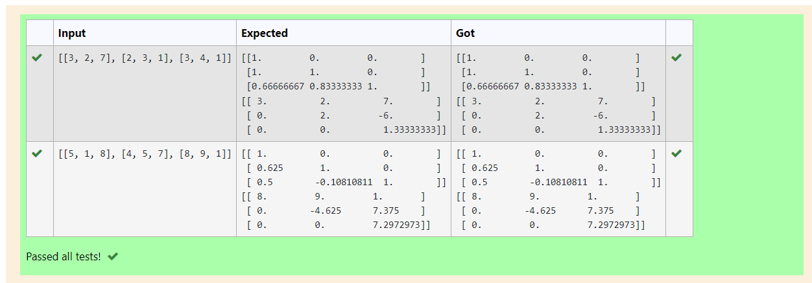
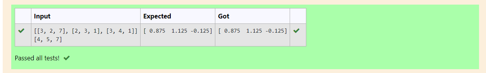

# LU Decomposition without zero on the diagonal

## AIM:
To write a program to find the LU Decomposition of a matrix.

## Equipments Required:
1. Hardware – PCs
2. Anaconda – Python 3.7 Installation / Moodle-Code Runner

## Algorithm
1. Import numpy library using import statement.
2.From scipy package import lu(). 
3. Get input from user and pass it as an array.
4. Get P,L,U matrix using lu().
5.Print L and U matrix.

## Program:
```
Program to find the LU Decomposition of a matrix.
Developed by: S JAVITH FARKHAN
RegisterNumber: 21004303
```
```
1.Use LU Decomposition to find L and U matrix

import numpy as np
import scipy
from scipy.linalg import lu
a=np.array(eval(input()))
p,l,u=lu(a)
print(l)
print(u)
```

```
2.Use LU Decomposition to solve a matrix.

import numpy as np
from scipy.linalg import lu_factor,lu_solve
a=eval(input())
b=eval(input())
lu,piv=lu_factor(a)
x=lu_solve((lu,piv),b)
print(x)
```

## Output:
1.Use LU Decomposition to find L and U matrix


2.Use LU Decomposition to solve a matrix.

## Result:
Thus the program to find the LU Decomposition of a matrix is written and verified using python programming.

